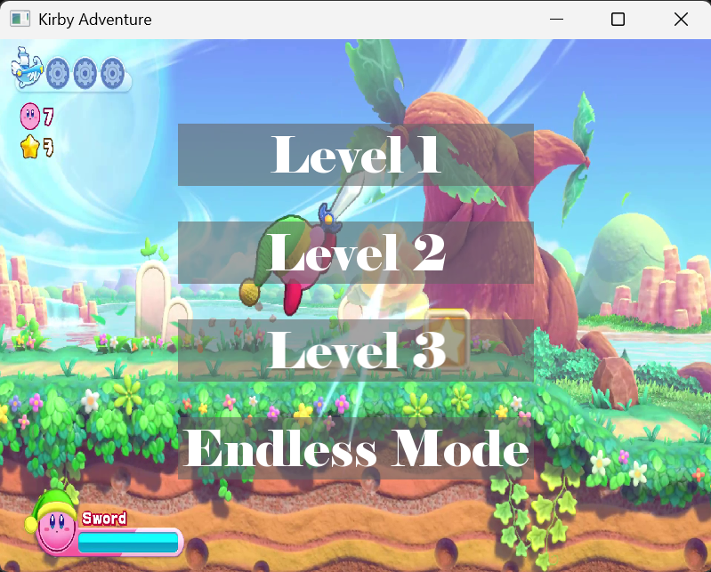

#SFML Kirby-like 2D Platformer
一个以 Kirby 为灵感的 2D 平台游戏 ，使用 C++ 和 SFML 3.0.0 构建，包含多个关卡、角色控制和互动游戏元素。该项目展示了我对游戏开发基础知识的理解，包括基于瓦片的地图、角色动画、碰撞检测和音频集成。

#项目概述
本项目是一个关卡式 2D 平台游戏 ，玩家控制一个类似 Kirby 的角色，在多种环境中探索、击败敌人并与游戏世界互动。
##主要功能：
平滑的角色移动，带有重力和跳跃机制

使用 Tiled Map Editor 创建的瓦片地图

具有地面、水、障碍物等自定义属性的地图瓦片
带动画、移动和生命值的敌人 AI
带有子弹/弹丸的角色攻击系统
游戏内显示生命值和伤害系统
背景音乐和音效
支持多个关卡和无限模式

#项目结构
SFML-Game/
├─ src/         # Source code (.cpp)
├─ include/     # Header files (.h)
├─ images/      # Game assets: sprites, tiles, backgrounds
├─ sound/       # Audio files: music, SFX
├─ main.cpp     # Entry point
└─ README.md

#安装与设置
1. 克隆仓库
2. 下载资源
获取 resources.zip 文件（包含 images/ 和 sound/ 文件夹）
将其解压到项目根目录，以便文件夹结构匹配：
SFML-Game/
├─ images/
└─ sound/
3.设置 SFML 3.0.0
安装 SFML 3.0.0
配置 Visual Studio 2022 以包含 SFML 头文件和链接库
4.构建并运行
在 Visual Studio 2022 中打开解决方案 .sln
编译并运行

#开发详情
##基于瓦片的地图
使用 Tiled Map Editor 创建
自定义瓦片属性（例如，solid、water）决定碰撞和移动
导出的地图支持 .txt 或 .tmx 格式以供游戏加载
支持动态背景和关卡变化
##角色系统
玩家控制的 Kirby 类角色
支持移动、跳跃和方向性攻击
带视觉显示的健康系统
攻击弹丸的弹丸管理器
##敌对系统
使用精灵数组动画化的敌人
响应地图碰撞和重力
会受到玩家子弹的伤害，伤害即死亡
##音频
背景音乐
跳跃、攻击、受到伤害等动作的声音效果

#视觉与资源
项目使用 自定义资源 ：
不同环境的瓦片精灵
玩家和敌人的角色精灵
不同级别的背景图片
音效和音乐
要正确运行游戏，资产必须从 resources.zip 单独下载。

#展示的技能
C++ & 面向对象编程
Kirby、Enemy、BulletManager 和 TileMap 的类
游戏开发基础
动画、碰撞检测、物理模拟
SFML 图形与音频
精灵、纹理、声音、音乐播放
关卡设计
基于瓦片的地图，使用 Tiled Map Editor
项目组织
代码、资源和资产的清晰分离
模块化架构以实现可扩展性

#未来改进
增加更多关卡和敌人类型
实现道具和收集品
集成带等级选择的菜单系统
保存/加载游戏进度
扩展攻击和连招机制

#备注
这个项目旨在用于教育目的并展示游戏开发技能。虽然仓库中只包含源代码，但完整的游戏需要资源文件才能正常运行。
